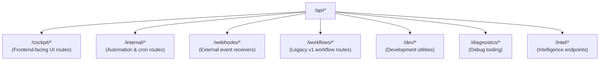
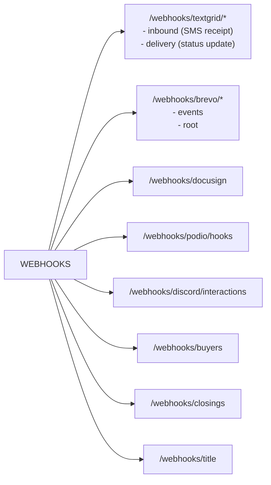
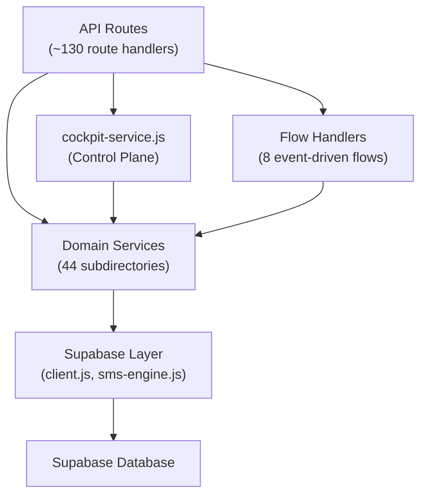
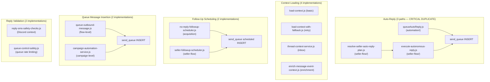
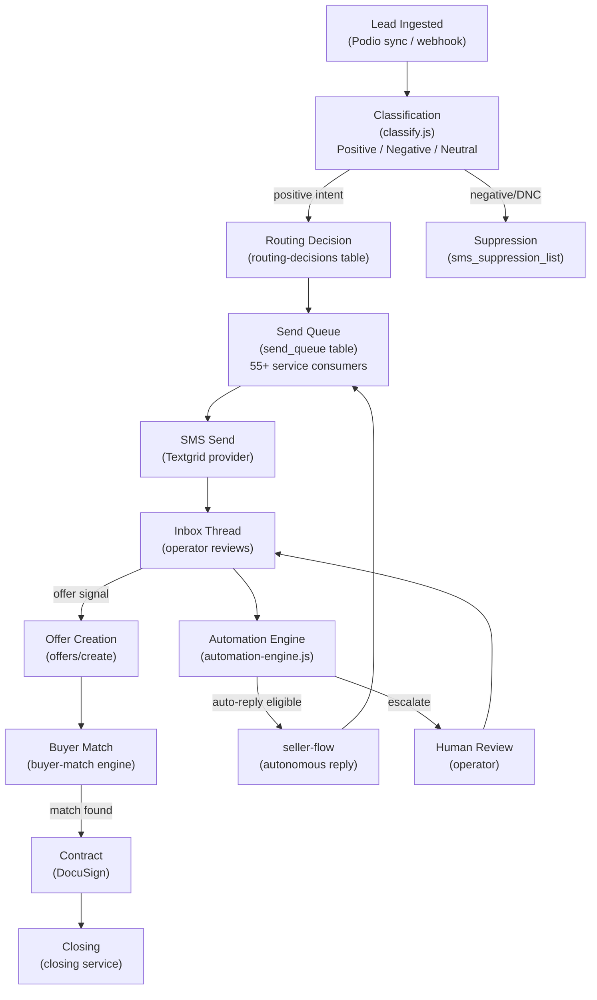
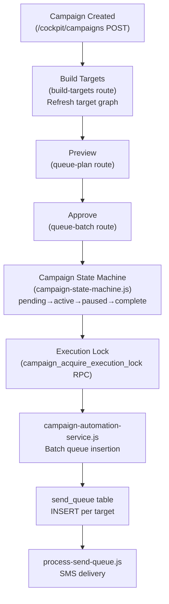
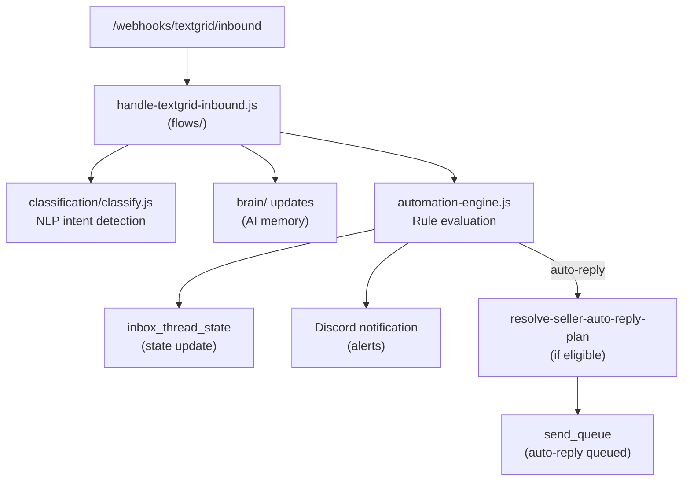

# Backend Architecture — REI Automation API

**Audit Date:** 2026-06-13  
**App:** `apps/api` (Next.js App Router, deployed)  
**Total lib files:** 380 JS files across 73 categories

---

## A. API Route Graph

### Route Namespaces

### Cockpit Routes (UI-facing)

```mermaid
graph LR
    COCKPIT --> CK_INBOX["/cockpit/inbox/*\n- live\n- threads/[key]\n- thread-hydration\n- thread-dossier\n- thread-state\n- thread-messages\n- send-now\n- queue-reply\n- schedule-reply\n- auto-reply\n- counts\n- debug-tabs"]
    COCKPIT --> CK_QUEUE["/cockpit/queue/*\n- run\n- status\n- approve\n- cancel\n- hold\n- retry\n- reschedule\n- retry-routing\n- retry-failed\n- auto-enqueue\n- reconcile\n- reprocess-paused\n- cancel-stale-followups\n- run-safe-batch\n- queue-more\n- control"]
    COCKPIT --> CK_CAMP["/cockpit/campaigns/*\n- CRUD\n- build-targets\n- lifecycle\n- progress\n- queue-batch\n- queue-plan\n- preview-targets\n- field-catalog\n- filter-options\n- options"]
    COCKPIT --> CK_WF["/cockpit/workflows/*\n- CRUD\n- clone\n- dry-run\n- pause/resume\n- steps\n- sender-pools\n- template-sets"]
    COCKPIT --> CK_BUYER["/cockpit/buyer-match/*\n- property/[id]\n- candidates/[id]\n- select-buyer\n- send-package\n- watchlist\n- run"]
    COCKPIT --> CK_THREADS["/cockpit/threads/*\n- list\n- [key]\n- sync\n- sync-all\n⚠️ DUPLICATE of inbox/threads"]
    COCKPIT --> CK_DEAL["/cockpit/deal-context/*\n- route\n- counts\n- property/[id]\n- thread/[key]"]
    COCKPIT --> CK_EMAIL["/cockpit/email/*\n- overview\n- threads\n- records\n- drafts\n- templates\n- manual-send\n- brevo-health"]
    COCKPIT --> CK_PROPS["/cockpit/properties/[id]/*\n- comps\n- comps/recalculate\n- push-to-underwriting\n- run-buyer-match\n- valuation-snapshot"]
    COCKPIT --> CK_METRICS["/cockpit/metrics/war-room"]
    COCKPIT --> CK_PIPELINE["/cockpit/pipeline/counts"]
    COCKPIT --> CK_HEALTH["/cockpit/health"]
    COCKPIT --> CK_OPS["/cockpit/ops/metrics"]
    COCKPIT --> CK_WFSTEPS["/cockpit/workflow-steps/[id]"]
    COCKPIT --> CK_WFTMPL["/cockpit/workflow-template-*"]
    COCKPIT --> CK_WFPOOL["/cockpit/workflow-sender-pools/[id]/members"]
    COCKPIT --> CK_DINTEL["/cockpit/deal-intelligence/thread/[key]"]
```

### Internal Routes (Automation/Cron-facing)

```mermaid
graph LR
    INTERNAL --> IN_INBOX["/internal/inbox/*\n- send-now ⚠️ DUPLICATE\n- thread-context"]
    INTERNAL --> IN_DB_INBOX["/internal/dashboard/inbox/*\n- live ⚠️ DUPLICATE\n- thread-state ⚠️ DUPLICATE\n- offer-stage-ai"]
    INTERNAL --> IN_QUEUE["/internal/queue/*\n- run ⚠️ DUPLICATE\n- retry ⚠️ DUPLICATE\n- status ⚠️ DUPLICATE\n- reconcile\n- dry-run\n- force-due\n- seed-test\n- smoke-create"]
    INTERNAL --> IN_OB["/internal/outbound/*\n- send-now ⚠️ TRIPLICATE\n- auto-enqueue ⚠️ DUPLICATE\n- direct-send\n- queue-message\n- feed-candidates\n- feed-master-owners\n- coverage-report\n- sms-eligible-audit"]
    INTERNAL --> IN_CAMP["/internal/campaigns/*\n- rebuild-target-graph"]
    INTERNAL --> IN_BUYERS["/internal/buyers/*\n- match\n- blast"]
    INTERNAL --> IN_OFFERS["/internal/offers/*\n- create\n- recalculate\n- underwrite"]
    INTERNAL --> IN_CONTRACTS["/internal/contracts/*\n- create\n- send\n- sync"]
    INTERNAL --> IN_CLOSINGS["/internal/closings/*\n- create\n- sync"]
    INTERNAL --> IN_AI["/internal/ai-router"]
    INTERNAL --> IN_AUTO["/internal/automation/*\n- run\n- replay\n- rules\n- runs\n- ingest-event"]
    INTERNAL --> IN_AUTOPILOT["/internal/autopilot/run"]
    INTERNAL --> IN_DISCORD["/internal/discord/*"]
    INTERNAL --> IN_EMAIL["/internal/email/*\n- cockpit\n- preview\n- send-test\n- queue/run"]
    INTERNAL --> IN_OPS["/internal/dashboard/ops/*\n- auth\n- feed\n- feeder\n- filters\n- kpis\n- map\n- queue"]
    INTERNAL --> IN_MISC["/internal/*\n- acquisition/score-*\n- context/lookup-phone\n- events/sync-podio\n- maintenance/*\n- revenue/*\n- runs/*\n- title/*\n- verification/*\n- alerts/*\n- run-locks/*"]
```

### Webhooks

---

## B. Service Graph

### Core Service Layers

### Domain Service Map

```mermaid
graph TD
    DOMAIN --> ACQ["acquisition/\n(10 files)\nLead decisions, contact lifecycle,\nno-reply follow-up, delivery retry"]
    DOMAIN --> AUTO["automation/\n(10 files)\nRule eval, action exec,\nevent logging, compliance"]
    DOMAIN --> CAMP["campaigns/\n(8 files)\nState machine, execution lock,\nprogress tracking, targeting"]
    DOMAIN --> CLASS["classification/\n(2 files)\nMessage classification,\nnegative reply detection"]
    DOMAIN --> INBOX_D["inbox/\n(8 files)\nThread state, send-now,\ncontext enrichment"]
    DOMAIN --> QUEUE_D["queue/\n(12 files)\nQueue processing, validation,\nretry, safety checks"]
    DOMAIN --> SELLER["seller-flow/\n(11 files)\nAutonomous reply planning,\nconversation automation,\nfollow-up scheduling"]
    DOMAIN --> OFFERS["offers/\n(14 files)\nOffer creation, sync,\nnegotiation, follow-up"]
    DOMAIN --> BRAIN["brain/\n(5 files)\nAI conversation memory,\npost-send/post-inbound updates"]
    DOMAIN --> WF["workflows/workflow-v2/\n(15+ files)\nComplex workflow execution,\ncondition evaluation"]
    DOMAIN --> BUYERS_D["buyers/\n(5 files)\nBuyer matching,\nresponse classification, blast"]
    DOMAIN --> COMMS["communications-engine/\n(1 file)\nState machine for message flows"]
    DOMAIN --> CONTEXT["context/\n(8 files)\nContext loading (4 overlapping impls)"]
    DOMAIN --> DELIVERY["delivery/\n(2 files)\nSMS delivery state, health guards"]
    DOMAIN --> EVENTS_D["events/\n(8 files)\nEvent logging, idempotency"]
    DOMAIN --> COMPLIANCE["compliance/\n(2 files)\nSuppression, phone validation"]
    DOMAIN --> MASTER["master-owners/\n(5 files)\nOwner feeding, follow-up timing"]
    DOMAIN --> ROUTING["routing/\n(4 files)\nMessage routing decisions"]
```

### Duplicate Service Logic

---

## C. Workflow Graph

### Lead-to-Closing Pipeline

### Campaign Execution Flow

### Inbound SMS Flow

---

## D. Cockpit Service — Canonical Control Plane

**File:** `src/lib/cockpit/cockpit-service.js`

| Function | Tables | Actions |
|----------|--------|---------|
| `getCockpitHealth()` | none | Reads feature flags |
| `getCockpitQueueStatus()` | send_queue | COUNT by status |
| `runQueueAction()` | send_queue | approve, cancel, retry, hold, reschedule, retry-routing |
| `runInboxAction()` | inbox_thread_state | send-now, queue-reply, schedule-reply, auto-reply |
| `patchThreadStateSafe()` | inbox_thread_state | UPSERT allowed fields |

**Allowed patch fields (whitelist):** is_read, is_pinned, is_archived, assigned_user, manual_review, conversation_status, seller_stage, temperature, autopilot_mode, wrong_number, opt_out, not_interested, suppression_status, unread_count

**Forbidden patch fields (blacklist):** seller_status, seller_state, is_hot_lead, positive_flag, classification

---

## E. Flow Handlers (`src/lib/flows/`)

| File | Trigger | Responsibility |
|------|---------|----------------|
| `handle-textgrid-inbound.js` | Inbound SMS webhook | Route incoming messages, classify, trigger automations |
| `handle-textgrid-delivery.js` | Delivery status webhook | Update queue item delivery state |
| `handle-brevo-event.js` | Email status webhook | Update email delivery state |
| `handle-buyer-match.js` | Buyer match trigger | Run geospatial match algorithm |
| `handle-closing.js` | Closing webhook | Process closing milestone |
| `handle-docusign.js` | DocuSign webhook | Contract signature events |
| `queue-outbound-message.js` | Queue action | Route outbound message to queue |
| `unknown-inbound-router.js` | Unknown sender | Route unknown contacts |
