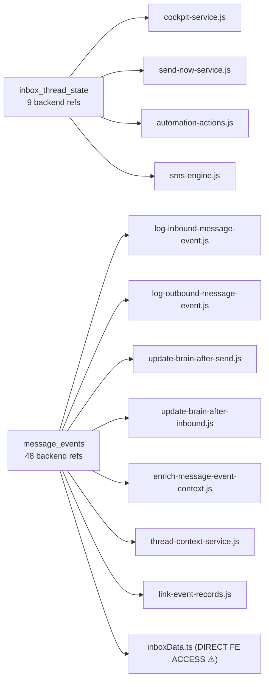

# Database Architecture — REI Automation Platform

**Audit Date:** 2026-06-13  
**Database:** Supabase (PostgreSQL)  
**Clients:** 3 total (1 frontend anon, 2 backend service-role)

---

## A. Supabase Clients

| Client | File | Key | Auth | Risk |
|--------|------|-----|------|------|
| Frontend | `apps/dashboard/src/lib/supabaseClient.ts` | `VITE_SUPABASE_ANON_KEY` | anon (public RLS) | **HIGH** — 44 files bypass API |
| Backend primary | `apps/api/src/lib/supabase/client.js` | `SUPABASE_SERVICE_ROLE_KEY` | service_role (bypasses RLS) | LOW |
| Backend default | `apps/api/src/lib/supabase/default-client.js` | Same as primary | service_role | LOW |

**Frontend client config:** `persistSession: false, autoRefreshToken: false, detectSessionInUrl: false` — no session persistence between refreshes.

---

## B. Table Consumer Map

### Critical Tables (55+ consumers)

```mermaid
graph TD
    SQ["send_queue\n55+ backend refs\n52+ frontend refs\n⚠️ HIGHEST RISK TABLE"]

    SQ --> BE1["cockpit-service.js (read/write)"]
    SQ --> BE2["run-send-queue.js (process)"]
    SQ --> BE3["process-send-queue.js (orchestrate)"]
    SQ --> BE4["sms-engine.js (insert/update)"]
    SQ --> BE5["automation-actions.js (insert)"]
    SQ --> BE6["execute-autonomous-reply.js (insert)"]
    SQ --> BE7["campaign-automation-service.js (insert)"]
    SQ --> BE8["queueAutoReply.js (insert)"]
    SQ --> BE9["delivery-retry-engine.js (update)"]
    SQ --> BE10["no-reply-followup-scheduler.js (insert)"]
    SQ --> BE11["seller-followup-scheduler.js (insert)"]
    SQ --> BE12["...10+ more services"]
    SQ --> FE1["queueData.ts (read)"]
    SQ --> FE2["fetchQueueModel.ts (read)"]
    SQ --> FE3["inboxData.ts (read)"]
    SQ --> FE4["...49+ more frontend refs"]
```



### Core State Tables



---

## C. Table Registry

### Core Operational Tables

| Table | Owner | Access | Risk |
|-------|-------|--------|------|
| `send_queue` | queue domain | Backend + Frontend Direct | **CRITICAL** |
| `message_events` | events domain | Backend + Frontend Direct | **CRITICAL** |
| `inbox_thread_state` | inbox domain | Backend only | HIGH |
| `operator_thread_state` | inbox domain | Backend + Frontend Direct | HIGH |
| `thread_ai_state` | brain domain | Frontend Direct only | HIGH |
| `canonical_inbox_threads` | inbox domain | Backend only | MEDIUM |
| `system_control` | system domain | Backend only | MEDIUM |

### Conversation / Negotiation Tables

| Table | Consumer | Direct Frontend? |
|-------|----------|-----------------|
| `conversation_threads` | inboxData.ts | **YES** |
| `conversation_turns` | inboxData.ts | **YES** |
| `seller_state_snapshots` | dashboardData.ts | **YES** |
| `negotiation_events` | sellerData.ts | **YES** |
| `routing_decisions` | inboxData.ts | **YES** |
| `ai_decisions` | inboxData.ts | **YES** |
| `deal_context_index` | Backend | NO |
| `deal_thread_state` | Backend | NO |
| `deal_thread_state_events` | Backend | NO |

### Campaign / Workflow Tables

| Table | Consumer | Direct Frontend? |
|-------|----------|-----------------|
| `sms_campaigns` | campaignData.ts | **YES** |
| `sms_campaign_targets` | campaignData.ts | **YES** |
| `campaigns` | Backend | NO |
| `campaign_events` | Backend | NO |
| `campaign_filters` | Backend | NO |
| `campaign_runs` | Backend | NO |
| `campaign_targets` | Backend (19 refs) | NO |
| `workflow_definitions` | Backend | NO |
| `workflow_nodes` | Backend | NO |
| `workflow_edges` | Backend | NO |
| `workflow_enrollments` | Backend (15 refs) | NO |
| `workflow_runs` | Backend | NO |
| `workflow_run_steps` | Backend | NO |
| `workflow_events` | Backend | NO |
| `workflows` | Backend (legacy v1) | NO |

### Buyer Intelligence Tables

| Table | Consumer | Direct Frontend? |
|-------|----------|-----------------|
| `buyer_entities_v2` | buyerData.ts | **YES** |
| `buyer_match_candidates` | buyerData.ts | **YES** |
| `buyer_match_runs` | buyerData.ts | **YES** |
| `buyer_purchase_events_v2` | buyerData.ts | **YES** |
| `buyer_activity_geo_rollups` | mapData.ts | **YES** |
| `buyer_comp_properties_v2` | Backend | NO |

### Contact / Owner Tables

| Table | Consumer | Direct Frontend? |
|-------|----------|-----------------|
| `master_owners` | mapData.ts, propertyData.ts | **YES** |
| `owners` | inboxData.ts | **YES** |
| `prospects` | propertyData.ts | **YES** |
| `properties` | Multiple data files | **YES** |
| `phones` | inboxData.ts | **YES** |
| `phone_numbers` | inboxData.ts | **YES** |

### Performance / Analytics Views

| View | Consumer | Notes |
|------|----------|-------|
| `language_performance_kpis_v` | Frontend Direct | Exposed to anon |
| `market_performance_kpis_v` | Frontend Direct | Exposed to anon |
| `number_performance_kpis_v` | Frontend Direct | Exposed to anon |
| `owner_type_performance_kpis_v` | Frontend Direct | Exposed to anon |
| `performance_message_events_v` | Frontend Direct | Exposed to anon |
| `performance_outliers_v` | Frontend Direct | Exposed to anon |
| `performance_trends_v` | Frontend Direct | Exposed to anon |
| `property_signal_performance_kpis_v` | Frontend Direct | Exposed to anon |
| `seller_signal_performance_kpis_v` | Frontend Direct | Exposed to anon |
| `stage_performance_kpis_v` | Frontend Direct | Exposed to anon |
| `template_performance_kpis_v` | Frontend Direct | Exposed to anon |
| `touch_performance_kpis_v` | Frontend Direct | Exposed to anon |
| `v_map_property_pins` | Frontend Direct | Exposed to anon |
| `v_operator_inbox_threads` | Frontend Direct | Exposed to anon |
| `v_sms_campaign_dashboard` | Frontend Direct | Exposed to anon |
| `v_sms_campaign_market_metrics` | Frontend Direct | Exposed to anon |
| `v_universal_inbox_threads` | Backend | NO |
| `v_universal_lead_command` | Backend | NO |
| `v_recent_sold_comps` | Backend + Frontend | **YES** |
| `agent_attribution_metrics_v` | Backend | NO |

---

## D. RPC Registry

### Backend RPCs

| RPC Name | Called From | Purpose |
|----------|------------|---------|
| `campaign_acquire_execution_lock` | campaign domain | Prevent concurrent campaign runs |
| `campaign_recompute_progress` | campaign domain | Recalculate campaign progress |
| `campaign_release_execution_lock` | campaign domain | Release campaign lock |
| `campaign_renew_execution_lock` | campaign domain | Extend active campaign lock |
| `campaign_transition_status` | campaign domain | State machine transition |
| `claim_queue_jobs` | queue domain | Atomic job claiming |
| `exec_sql` | diagnostics | Raw SQL execution (dev only) |
| `get_buyer_match_candidates` | buyer match | Geospatial match query |
| `get_comp_candidates_for_subject` | offers/comps | Comparable property lookup |
| `get_ownership_check_template_stats_v2` | template domain | Template performance stats |
| `get_triggers` | automation | Load automation triggers |
| `refresh_campaign_target_graph` | campaigns | Rebuild target graph |
| `sync_deal_thread_state_from_events` | deal context | Reconcile deal state |
| `update_send_queue_status` | queue domain | Atomic queue status update |

### Frontend RPCs (⚠️ Direct DB Access)

| RPC Name | Called From | Risk |
|----------|------------|------|
| `get_command_map_seller_pins` | commandMapData.ts | **HIGH** — property pins exposed to anon |
| `get_comp_candidates_for_subject` | propertyData.ts | MEDIUM — same RPC as backend |
| `get_buyers_for_property` | buyerData.ts | **HIGH** — buyer data to anon key |

---

## E. Shared Tables (Frontend + Backend Both Access)

These 15 tables are queried directly from BOTH the frontend (anon key) and backend (service role):

| Table | Frontend File | Backend Service | Risk |
|-------|--------------|-----------------|------|
| `send_queue` | queueData.ts | 24 services | **CRITICAL** |
| `message_events` | inboxData.ts | 7 services | **CRITICAL** |
| `properties` | propertyData.ts, acquisitionData.ts | context, intel | HIGH |
| `master_owners` | mapData.ts | master-owners | HIGH |
| `buyer_entities_v2` | buyerData.ts | buyers domain | HIGH |
| `buyer_match_candidates` | buyerData.ts | buyer-match | HIGH |
| `buyer_match_runs` | buyerData.ts | buyer-match | MEDIUM |
| `buyer_purchase_events_v2` | buyerData.ts | buyers domain | MEDIUM |
| `sms_suppression_list` | propertyData.ts | compliance | HIGH |
| `sms_templates` | templateData.ts | template domain | MEDIUM |
| `operator_thread_state` | inboxData.ts | cockpit | HIGH |
| `recently_sold_properties` | sellerData.ts | intelligence | MEDIUM |
| `textgrid_numbers` | textgridRouting.ts | routing | HIGH |
| `census_geo_metrics` | censusData.ts | intel | LOW |
| `v_recent_sold_comps` | propertyData.ts | offers | LOW |

---

## F. Frontend Direct Supabase Access — Full File List (44 files)

All files under `apps/dashboard/src/` that call `supabase.from()` or `.rpc()`:

```
lib/data/
├── acquisitionData.ts
├── buyerActivityMapData.ts
├── calendarData.ts
├── censusData.ts
├── censusMapData.ts
├── commandMapData.ts        ← RPC: get_command_map_seller_pins
├── copilotContextData.ts
├── dashboardData.ts
├── dashboardDataLayer.ts
├── dealContext.ts
├── dealIntelligenceData.ts
├── fetchQueueModel.ts       ← send_queue direct
├── inboxActivityData.ts
├── inboxAutoReply.ts
├── inboxData.ts             ← message_events, conversation_threads, phones, owners
├── inboxIntelligencePhase3.ts
├── inboxKpis.ts
├── inboxWorkflowData.ts
├── kpiDashboardData.ts
├── mapData.ts
├── operationalKpis.ts
├── performanceIntelligence.ts
├── propertyData.ts          ← RPC: get_comp_candidates_for_subject
├── queueData.ts             ← send_queue (52+ refs)
├── realtime.ts
├── sellerData.ts
├── supabaseHealth.ts
├── templateData.ts
├── textgridRouting.ts
├── watchlistData.ts

lib/
└── watchlistContext.tsx

modules/inbox/
├── inbox.adapter.ts
└── templates/TemplateData.ts

views/buyer-match/
└── data/buyerMatchData.ts   ← RPC: get_buyers_for_property

views/analytics/
└── data/analyticsData.ts

views/map/
└── data/mapLayerData.ts

views/campaign-command/
└── data/campaignData.ts

views/pipeline/
└── data/pipelineData.ts

views/email-command/
└── data/emailData.ts

... (44 total)
```
