# Frontend Architecture — REI Automation Dashboard

**Audit Date:** 2026-06-13  
**App:** `apps/dashboard` (Vite + React + TypeScript)  
**Deployment Target:** ops.leadcommand.ai

---

## A. Route Graph

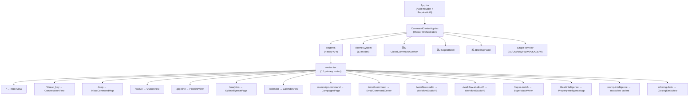

---

## B. Component Dependency Graph

### Inbox (`/`)

```mermaid
graph TD
    InboxView --> InboxPage
    InboxPage --> NexusTopBar
    InboxPage --> InboxSidebar
    InboxPage --> InboxConversationTable
    InboxPage --> ChatThread
    InboxPage --> InboxKpiDashboard
    InboxPage --> QueueCommandCenter
    InboxPage --> BuyerMatchWorkspace
    InboxPage --> InboxActivityPanel
    InboxPage --> MetricsWarRoom
    InboxPage --> NexusNotificationCenter
    InboxPage --> InboxCommandPalette
    InboxPage --> InboxSchedulePanel
    InboxPage --> InboxUtilityDrawer
    InboxPage --> CommandView

    InboxConversationTable --> InboxThreadRow
    InboxConversationTable --> InboxStatusTabs
    InboxConversationTable --> AdvancedFiltersPopover
    InboxConversationTable --> InboxThreadActions

    ChatThread --> Composer
    Composer --> TemplatePicker
    Composer --> ComposerTranslationBar
    Composer --> TemplatePopover

    InboxSidebar --> InboxStatusTabs

    InboxActivityPanel --> ActivityFeedCard
    InboxActivityPanel --> ActivityTimeline
    ActivityTimeline --> ActivityTimelineGroup
    ActivityTimeline --> ActivityEventRow
    ActivityEventRow --> ActivityEventDetails

    QueueCommandCenter --> QueueHealthPanel
    QueueCommandCenter --> QueueFailureTaxonomy
    QueueCommandCenter --> QueueRowInspector
    QueueCommandCenter --> QueueActionsBar
    QueueCommandCenter --> QueuePipelineBar
    QueueCommandCenter --> RecentQueueEvents
    QueueCommandCenter --> MarketLoadPanel
    QueueCommandCenter --> RoutingCoveragePanel
    QueueCommandCenter --> TemplateCoveragePanel
    QueueCommandCenter --> SenderNumberHealthPanel

    InboxPage -.->|"ai-command-center.ts\n(13 intel scores)"| AIC["ThreadCommandIntel"]
    InboxPage -.->|"autonomy-engine.ts\n(market model)"| AUE["AutonomousEngineModel"]
    InboxPage -.->|"inbox-store.ts\n(reducer)"| STORE["InboxState"]
```

### Queue (`/queue`)

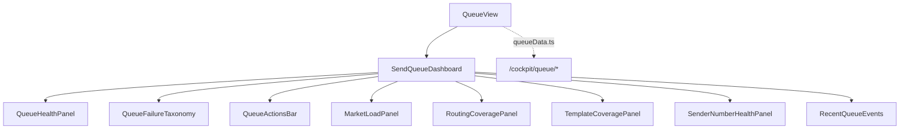

### Campaign Command (`/campaign-command`)

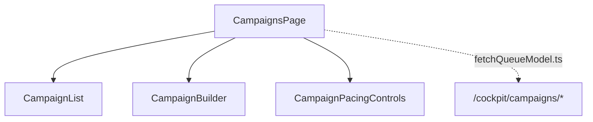

### Workflow Studio (`/workflow-studio`)

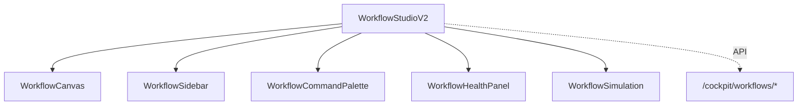

### Map (`/map`)

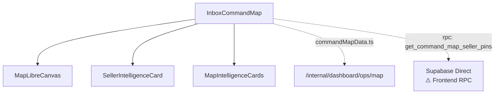

---

## C. CSS Ownership Graph

### Inbox Surface

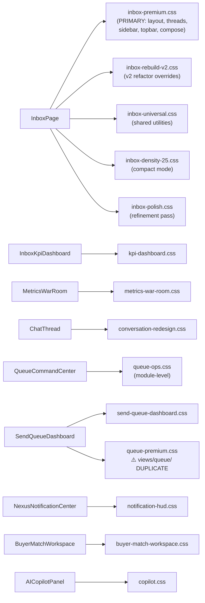

**Ownership conflict:** `queue-ops.css` (modules/inbox/) AND `queue-premium.css` (views/queue/) both style queue surfaces.

### Global / Theme Surface

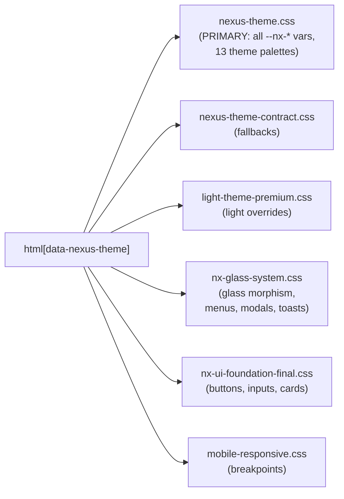

### Command Palette

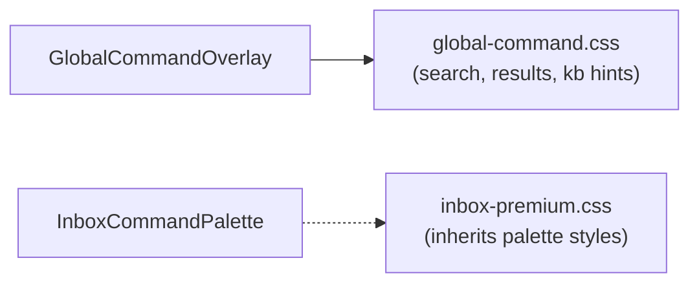

### Copilot

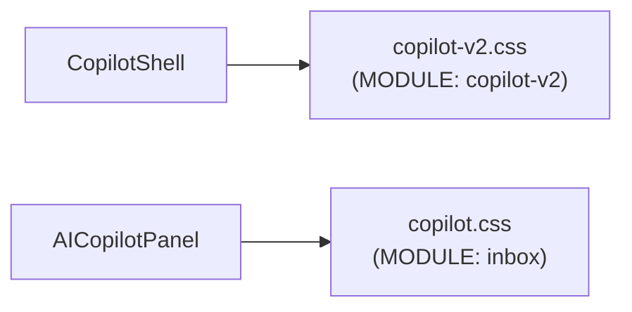

**Ownership conflict:** `copilot.css` (inbox module) AND `copilot-v2.css` (copilot module) both style copilot surfaces.

### Override Load Order in InboxPage.tsx

```
index.css
→ nexus-theme.css
→ nx-glass-system.css
→ nx-ui-foundation-final.css
→ inbox-premium.css
→ inbox-rebuild-v2.css
→ inbox-universal.css
→ inbox-polish.css           ← last import = final authority
```

---

## D. Theme Graph

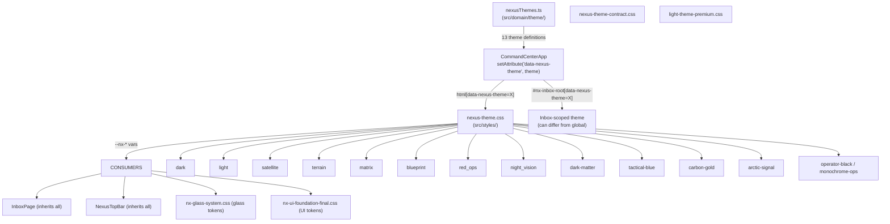

**Duplicate theme ownership:**
- `nexus-theme.css` defines all `--nx-*` tokens
- `nexus-theme-contract.css` redefines fallbacks for the same tokens
- `light-theme-premium.css` overrides light-mode tokens a third time
- `nx-ui-foundation-final.css` also sets baseline accent/menu tokens

---

## E. State Management Systems

| System | Location | Type | Scope |
|--------|----------|------|-------|
| **inbox-store** | `modules/inbox/inbox-store.ts` | Redux-like reducer | Inbox thread/message state |
| **watchlistContext** | `lib/watchlistContext.tsx` | React Context | Watchlist persistence |
| **commandStore** | `data/commandStore.ts` | Static catalog | Command palette items (not reactive) |

No global state manager (no Zustand, no Redux). State is colocated per module.

---

## F. File Counts

| Category | Count |
|----------|-------|
| Views | 16 |
| Modules | 5 (inbox, command-center, copilot, core, properties) |
| CSS files (total) | 37 |
| CSS files targeting inbox | 13 |
| Domain files | 21 |
| Lib/data files | 49 |
| Total dashboard source files | ~420 |
