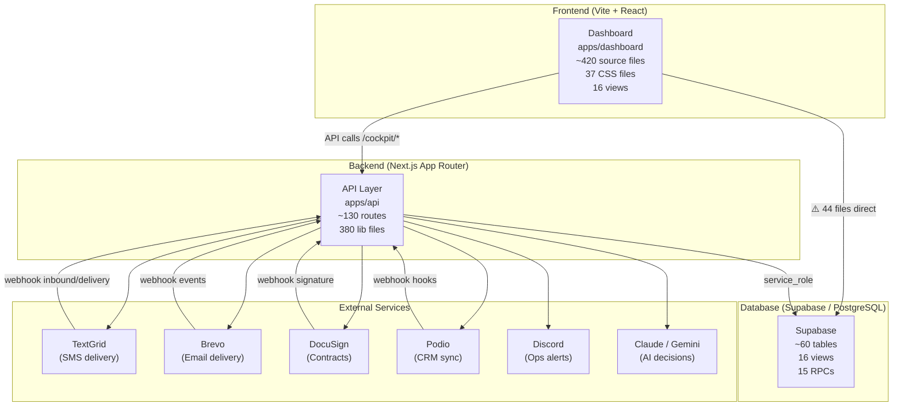
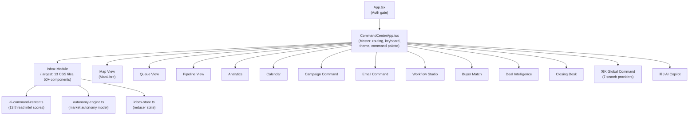
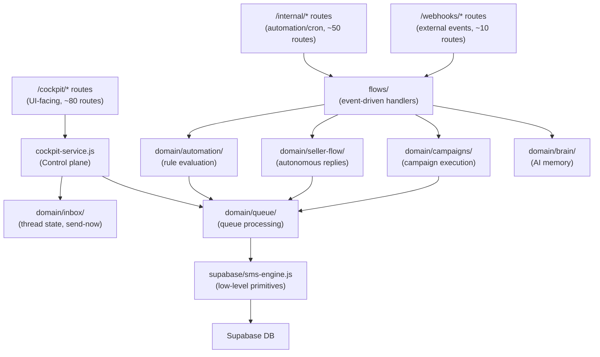
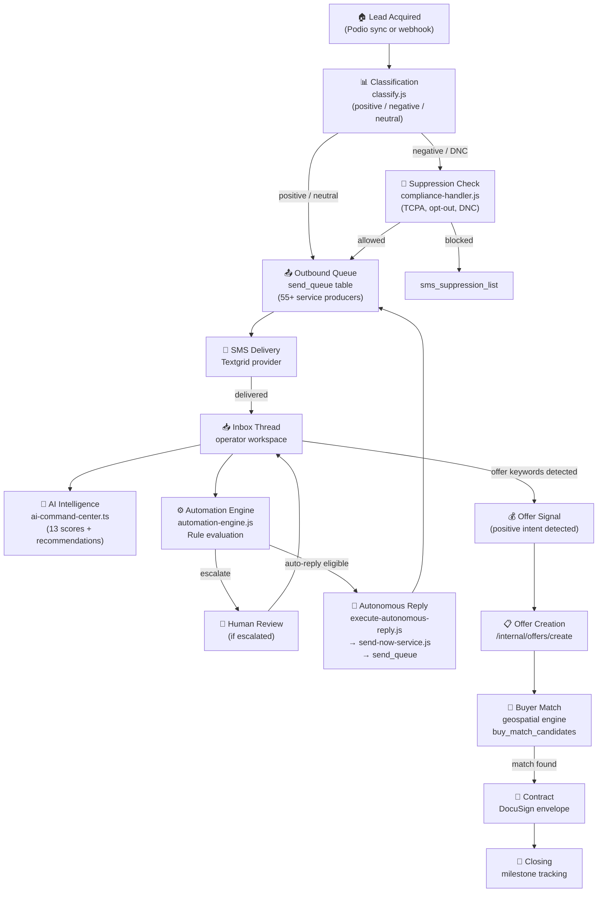
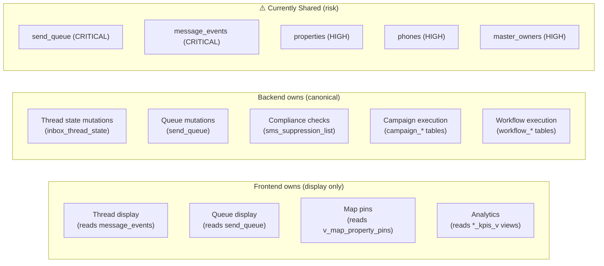
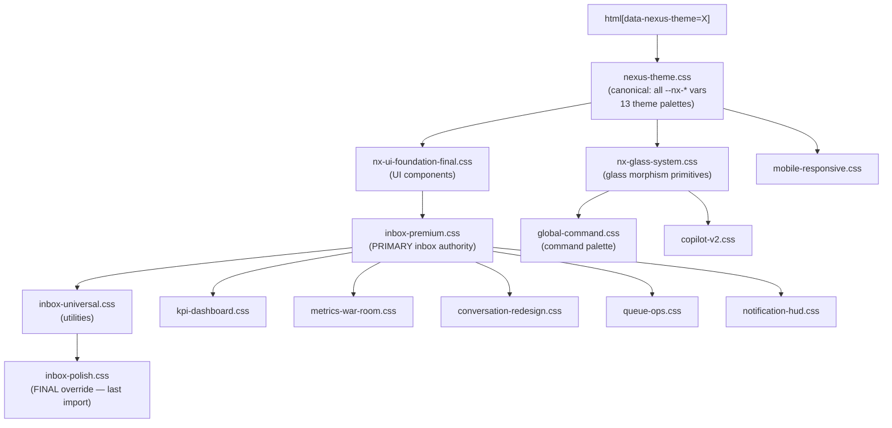
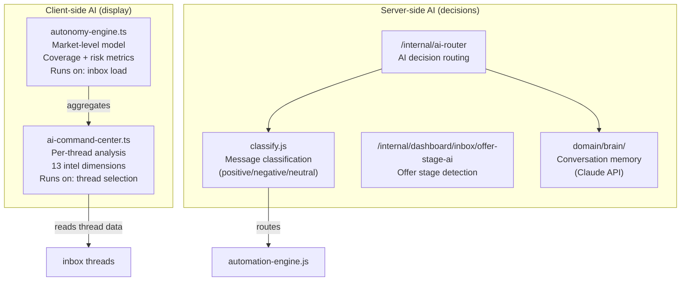
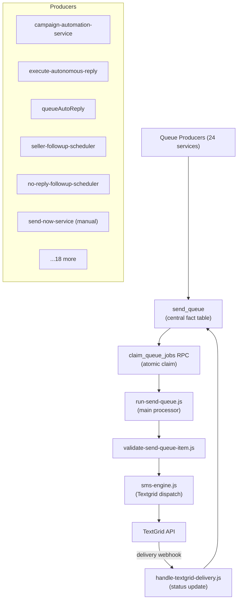

# Master System Map — REI Automation Platform

**Audit Date:** 2026-06-13  
**Platform:** Nexus REI Automation  
**Production URL:** ops.leadcommand.ai

---

## Executive Architecture

---

## Frontend Architecture

---

## Backend Architecture

---

## Lead-to-Closing Pipeline

---

## Data Ownership Map

---

## CSS Architecture

---

## AI Systems

---

## Queue System

---

## Final Statistics

| Metric | Count |
|--------|-------|
| **Total source files (frontend)** | ~420 |
| **Total source files (backend lib)** | ~380 |
| **Total API routes** | ~133 |
| **Total domain service groups** | 44 |
| **Total Supabase tables** | ~60 |
| **Total Supabase views** | ~20 |
| **Total RPCs** | 15 backend + 3 frontend direct |
| **Frontend files with direct Supabase access** | 44 |
| **Shared tables (frontend + backend)** | 15 |
| **CSS files total** | 37 |
| **CSS files targeting inbox** | 13 |
| **Duplicate ownership findings** | 30 |
| **Conflict findings** | 33 |
| **Critical risks** | 8 |
| **High risks** | 12 |
| **Total AI scoring dimensions** | 13 (per-thread) |
| **Theme modes** | 13 |
| **Queue service producers** | 24+ |

---

## Recommended Cleanup Order

**Phase 1 — Stop the bleeding (security + correctness)**
1. Add RLS to `send_queue`, `message_events`, `sms_suppression_list`, `phones`
2. Gate all `/internal/*` routes from frontend origin
3. Route all autonomous replies through `send-now-service.js`
4. Add idempotency key to `runSupabaseCandidateFeeder` (RISK-003)

**Phase 2 — Consolidate duplicates (reliability)**
5. Deprecate `/workflows/*` — migrate callers to `/cockpit/workflows/*`
6. Merge `/cockpit/threads/*` into `/cockpit/inbox/threads/*`
7. Merge `queueAutoReply.js` into `execute-autonomous-reply.js`
8. Consolidate context loading into single `loadContextWithFallback`
9. Choose canonical send-now route; deprecate 2 others

**Phase 3 — CSS consolidation (maintainability)**
10. Merge `inbox-rebuild-v2.css` into `inbox-premium.css`
11. Merge `light-theme-premium.css` into `nexus-theme.css`
12. Deprecate `queue-premium.css` in views/queue; use `queue-ops.css`
13. Document and enforce CSS import order in `InboxPage.tsx`

**Phase 4 — API migration (architecture)**
14. Move `queueData.ts` + `fetchQueueModel.ts` from direct Supabase → `/cockpit/queue/status`
15. Move `inboxData.ts` message queries → `/cockpit/inbox/thread-messages`
16. Move buyer match RPC → `/cockpit/buyer-match/property/[id]/candidates`
17. Move map pin RPC → `/internal/dashboard/ops/map`
18. Gate `dev/*` routes behind `NODE_ENV !== 'production'`

**Phase 5 — Service unification (long-term)**
19. Create `lib/domain/queue/schedule-followup.js` (unify 2 schedulers)
20. Create `InboxThreadStateService` (unify read + write)
21. Add shared data contract between `ai-command-center.ts` and `autonomy-engine.ts`
22. Formalize `lib/domain/validation/MessageValidationService.js` (unify 2 validators)
